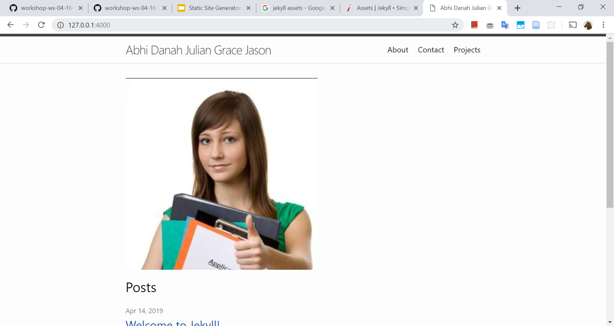
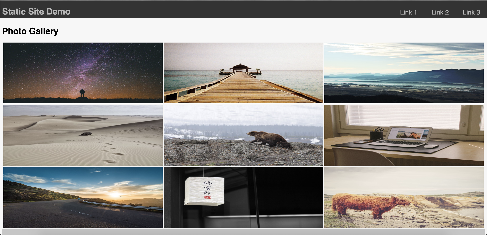
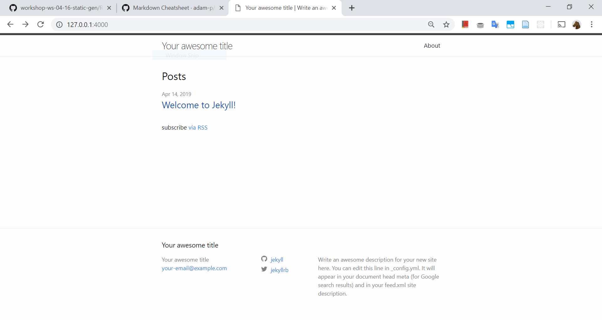
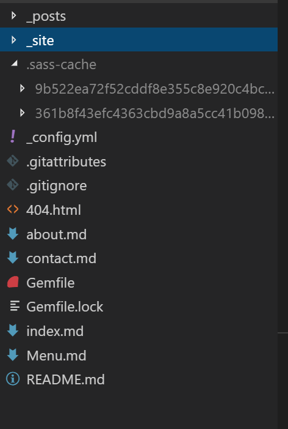
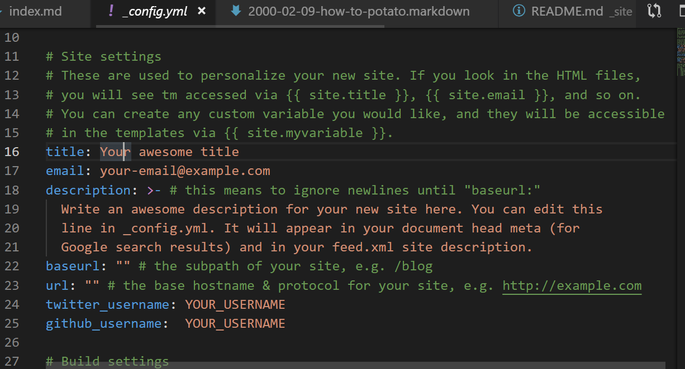
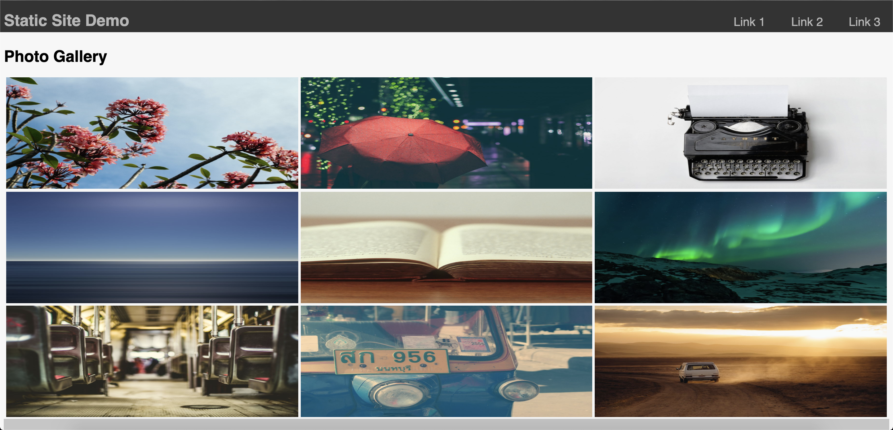

# CS52 Workshops: Introduction to Static Site Generation with Jekyll

The websites we've been building so far (think Lab 1 and 2) fall under the category of static sites. 

Static sites respond to requests much faster :horse_racing: than dynamic ones, provide improved security :warning: since there's nothing dynamic to be exploited, and are better suited at handling traffic surges  :traffic_light:, as they only need to serve static files. If you are building a site where its information doesn't need to be constantly updated, static sites are a great option. :raised_hands:

**_*Static site generators*_** allow an entire site to be built in one go on your computer before being put on the server. 

There are many different static site generators out there, but today we’re going to be working with a static site generator called **Jekyll**. :sparkles:

**Jekyll** is the static site generator behind the CS 52 course website, is integrated into GitHub, and is a pretty popular choice among static site generators these days.

## Overview

Today we’re going to show you how to generate a static sites using Jekyll. :tada:

We’ll be going over two different use cases of Jekyll for static site generation:
1. Using Jekyll's templates to building a static site from the ground up
2. Using Jekyll to turn a pre-existing site into a static site

For use case #1, we will be making a personal portfolio website. :information_desk_person:



For use case #2, we'll be transforming a typical HTML & CSS photo gallery site into a Jekyll site, and updating some functionalities on the site using Liquid. :camera:



## Setup

### Windows

1. Install a [Ruby+Devkit](https://rubyinstaller.org/) version . Use default options for installation.
2. Open a new command prompt window from the start menu, so that changes to the PATH environment variable becomes effective.
3. Install Jekyll and Bundler via: `gem install jekyll bundler` :gem:

### Mac 

1. In terminal, install Xcode command line tools: `xcode-select --install` :gem:

2. You should have homebrew by now so we're not going over that

3. Install Ruby `brew install ruby` :gem:

4. Install Jekyll `gem install jekyll` :gem:

5. Install Jekyll Bundler `gem install bundler` :gem:

### Check Jekyll

* `jekyll -v`

You should see this: `jekyll 3.8.5`

## Use Case #1: Using Jekyll Templates to Build a Static Site

Let's say you want to create a static site from scratch. Jekyll's templates allow you to quickly generate a static site. And now, we're going to do just that! [Here's](http://workshopstatic.surge.sh/) a simple website we hacked up in less than 10 minutes using jekyll. 

1. Use the command line to make a new directory. You will be placing all the files for your static site into this directory.

* `mkdir [insert_your_directory_name]` :dizzy:
 
2. `cd` into your newly created directory.

3. Create your Jekyll site with the following command:

* `jekyll new template_site` :dizzy:

4. `cd` into the directory with your new site:

* `cd template_site` :dizzy:

5. Host it locally!

* `jekyll serve` :dizzy:

6. Visit localhost:4000 to check out your new site! 



And, voila! You now have a basic Jekyll site you can tweak at your own leisure. That's all! (we wish)

Now let's try making a couple modifications to it 

### 1. Adding pages

* Your directory should look a little something like this:



* Now let's try adding that page - Ready for some HTML!? No? That's fine cause we won't be touching ANY HTML to add a page! Begin by making a new markdown (`.md`) file. I think a ***contact*** page would be useful, don't you? 

* Create a contact page: `touch contact.md` 

* Now copy the following code segment:
```
---
layout: page
title: Contact
permalink: /contact/
---

Pudding chocolate bar fruitcake dessert fruitcake. Macaroon tart jelly-o apple pie bear claw. Chupa chups topping macaroon wafer halvah dessert jujubes. Dessert jelly beans chocolate cake. Pudding danish chocolate bar. Pudding cake soufflé I love carrot cake.

```
* Change the content as you'd like and hit that save button! and now open the `_site` folder, you should notice a `Contact` folder containing an html file - yup that's it - you just did that all through a tiny markdown file! Feel free to add any more pages as you'd like!

* Look in terminal at your template site directory and you should have a bunch of files. These were all automatically generated to make your life easier! 


### 2. Adding Posts

* The process for adding new posts is very similar to that of sites, start by opening the the `_posts` folder.
* Create a new file with the title: `YYYY-MM-DD-file-name-here.markdown` and add the following code 
```
---
layout: post
title:  "YOUR TITLE HERE"
date:   YOUR-DATE-HERE 11:10:16 -0400
categories: jekyll update
---
Potato Potah-to Potato Potah-to Potato Potah-to Potato Potah-to Potato Potah-to Potato Potah-to Potato Potah-to Potato Potah-to Potato Potah-to Potato Potah-to Potato Potah-to Potato Potah-to Potato Potah-to Potato Potah-to Potato Potah-to Potato Potah-to Potato Potah-to Potato Potah-to Potato Potah-to Potato Potah-to Potato Potah-to Potato Potah-to Potato Potah-to Potato Potah-to Potato Potah-to Potato Potah-to Potato Potah-to Potato Potah-to Potato Potah-to Potato Potah-to Potato Potah-to Potato Potah-to Potato Potah-to Potato Potah-to 


def print_hi(name)
  puts "Hi, #{name}"
end
print_hi('Tom')
#=> prints 'Hi, Tom' to STDOUT.


```

* Modify the content as you like and hit save! Check your website again, do you see your post!

### 3. Using CSS, SASS JS, images and other assets 

* Just add the asset to the folder `assets\`, you may have to create an `assets` folder in your root directory
* Try adding an image to your `index.md` right now!

### 4. Change the config to change the header, site title, footer, etc

* Make changes as below in `config.yml`. Try to customize the content of this website further! :sunglasses:



## Use Case #2: Using Jekyll to Turn a Pre-Existing Site into a Static Site

#### 1. Create a site
  * Jekyll is also able to build on a site that has already been created if you would prefer to design it yourself.
  * For the purpose of the demo, we've included a premade `index.html` and `style.css` which in the `starter_code` folder of our repo. Go ahead and download a copy of these files and `cd` into the directory

#### 2. Build the site
* We need Jekyll to build the site before we can view it. To do this, we can run two commands:
 * `jekyll build` - This will build our static site to a directory called `_site`. 
 * `jekyll serve` - Does the same thing except it will rebuild any time you change the site and will run a local server a `http://localhost:4000`. :dizzy:
 * While developing the site it's better to use `jekyll serve` as it updates with any changes you make.
 * Go ahead and run `jekyll serve` and go to `http://localhost:4000` in your browser. You should see the site build and styled as it is below, though note that you will likely have different images, as the images are randomly pulled in from a photo database: 



#### 3. Learn Liquid :shower:

Liquid is a templating language specific to Jekyll. It has three main parts: objects, tags, and filters.
  ##### Objects:
   * Objects are denoted by double curly braces and tell Liquid where to output content. This can be helpful for variables that are consistent throughout the website such as `site_name`
   * Let's go ahead and try these out. At the top of your `index.html` file add the following:
```
---
site_name: Static Site Demo
---
```
 * Now that we've declared `site_name` let's input it into our html by changing the header to:
```
  <header>
          <h1>{{page.site_name}}</h1>
          <nav id="navbar">
              ...
          </nav>
  </header>
```
 * Awesome! Now if we had multiple pages or repeated the same element, we only have to change it in one place
 
  ##### Tags:
   * Tags are denoted by curly braces and percent signs: ``. Tags control the logic and control flow for the project.
   * We'll start by implementing a for loop into our webpage to make laying out our images easier
   * First let's add the links to our images as a list in the same location we added our `site_name` variable:
 ```
 ---
 site_name: Static Site Demo
 image_links:
 - https://picsum.photos/1200/900/?random=1
 - https://picsum.photos/1200/900/?random=2
 - https://picsum.photos/1200/900/?random=3
 - https://picsum.photos/1200/900/?random=4
 - https://picsum.photos/1200/900/?random=5
 - https://picsum.photos/1200/900/?random=6
 - https://picsum.photos/1200/900/?random=7
 - https://picsum.photos/1200/900/?random=8
 - https://picsum.photos/1200/900/?random=9
 ---
 ```
   * Next, let's get rid of all the messy html in our `images-container` and replace it with a simple for loop:
```
<div id="images-container">
    
        
    
</div>
```
  * Our output has remained the same, but now we can add, remove, or change images with ease!
  
  * Tags also make it possible for us to utilize if statements and control how the webpage is being displayed, let's try hiding our biography section
  * First we'll add a variable to the top of our html called `show_bio` and set it to `false`
  * Next we can surround our `bio-container` with an if statement:
```

    <div id="bio-container">
        ...
    </div>

```
  * This now allows us to decide whether or not we want to show our biography by simply adjusting the `show_bio` variable
  
  ##### Filters
   * Filters change the output of a Liquid object. They must used within an output and are separated by a |, much like pipes used in unix. 
   * Let's convert our `site_name` to uppercase letters by utilizing a pipe in the header file:
```
<header>
  <h1>{{page.site_name | upcase }}</h1>
  <nav id="navbar">
      ...
  </nav>
</header>
```
  ##### Customization
  * Try playing around with Liquid some more to further customize this gallery site! :sparkles:


## Deploy

* Serve the website to ensure it's looking good : `jekyll serve`
* Now stop the local server: `Ctrl + C`
* Build it: `jekyll build`
* Then publish the project to Surge `surge _site`, or whatever your prefer (like GitHub Pages)
* D E P L O Y E D :sunglasses:

## Summary / What you Learned

* [ ] The benefits of using a static site
* [ ] How to install Jekyll to your computer
* [ ] Creating a static site using Jekyll templates
* [ ] How to turn a pre-existing site into a static site with Jekyll
* [ ] How to work with objects, tags, and filters in the Liquid templating language

## Extra Credit

* Add ***cooooollll*** [plugins](https://jekyllrb.com/docs/plugins/) to your jekyll site
* Try Jekyll with a different starting template 
* Make your style ~groovy~ awesome.


## Reflection

* What are the benefits of using a static site?
* Can you think of some times when it might be more beneficial to use a static site than a dynamic site?


## Resources

* https://learn.cloudcannon.com/jekyll-setup/

For formatting inspiration:
* https://github.com/dartmouth-cs52-19S/workshop-ws-04-19-css
* https://github.com/dartmouth-cs52-19S/workshop-fancy-css-workshop

## Research

* https://hackernoon.com/the-advantages-of-building-dynamic-websites-bc914071a155
* https://programminghistorian.org/en/lessons/building-static-sites-with-jekyll-github-pages#what-are-static-sites-jekyll-etc--why-might-i-care-
* https://learn.cloudcannon.com/jekyll/introduction-to-jekyll-layouts/
* https://help.github.com/en/articles/using-a-static-site-generator-other-than-jekyll
* https://www.everystep-automation.com/web-applications-vs-static-websites-whats-difference/
* https://www.sitepoint.com/7-reasons-use-static-site-generator/
* https://rocketmedia.com/blog/static-vs-dynamic-websites
