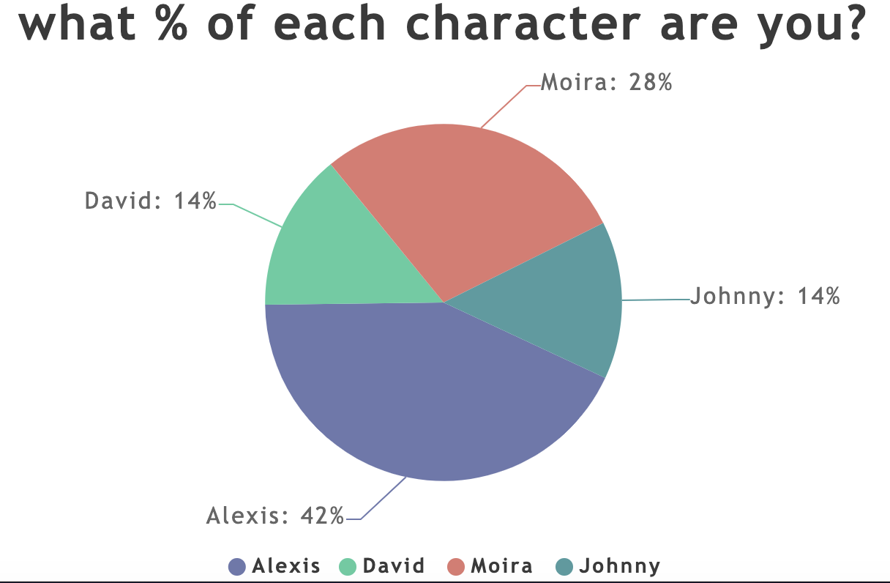

# CS52 Workshops:  Introduction to JS Graphics


Javascript graphical libraries are a powerful and fun way to add elaborate animations to your apps and websites! Today we're going to try some out for ourselves and see how these tools can be used to enhance our own projects.

## Overview

Today we're going to build on an existing Buzzfeed quiz with some animations! By the end of the workshop, you will have a quiz with fancy animations throughout, created using multiple js graphical libraries, and a graphical representation of results each time the quiz is taken.

## Setup

We're going to be building off and enhancing an existing Buzzfeed quiz! To begin, clone down this repo. The directory called "quiz" contains the quiz we will be working with. Right now it doesn't have any elaborate animations, so let's add some!

As you are working, you can always view your quiz by running:

```python -m SimpleHTTPServer 9000```

## Part 1: Add a "Burst" Click Effect

### Load in Mo.js

First we need to load in the mo.js library! In your index.html file, add the following to the *body* section.

```html
<script src="//cdn.jsdelivr.net/mojs/latest/mo.min.js"></script>
```

### Burst shape
The click effect we want to achieve consists of several shapes. The first we want to create is a ```Burst``` object. The Burst is a special module in mojs that gives us the "bursting" quality of animation. From now on in this section, all your code should go in your ```main.js``` file in the quiz directory. Here is the code we want to use for our burst:

```javascript
const burst = new mojs.Burst({ 
  left: 0, top: 0,
  radius: { 0: 100 },
  count: 12,
  children: {
    shape: 'polygon',
    radius: 20,
    angle: { 360: 0 },
    fill: { '#f70909' : '#eddc80' },
    duration: 1300
  }
});
```

We control how the animation plays out by specifying specific properties such as ```left``` and ```top```, which determine the initial position of the burst, ```radius```, which determines the radius of the circle formed by all the burst particles, and ```count```, which determines the number of shapes or particles in a single burst. Since all the particles in the burst animation are considered to be children of the original ```Burst``` object, we can control the individual particles with the ```children``` property. In this case, the children are polygons.


The next shape we want to use in our animation is a circle. The circle will expand out with our burst to add to the nice bursting effect.

```javascript
const circle = new mojs.Shape({
  left: 0, top: 0,
  count: 10,
  stroke: { '#e2441d' : '#f99931' },
  strokeWidth: { 20 : 0 },
  fill: 'none',
  scale: { 0: 1.5, easing: 'elastic.out' },
  radius: { 0: 60 },
  duration: 1000,
  opacity:  { 1: 0.2 }
});
```
We use the simple shape tools available through mojs to create a circle. Calling ```new.mojs.Shape()``` creates a circle by default. We then define the basic properties of ```stroke```, ```strokeWidth```, ```fill```, ```radius```, ```opacity```, etc.  We also define a few parameters that animate our circle, such as ```duration``` and ```easing```, which we define as "elastic.out," which makes our circle expand out in a similar way to our burst.

The final component of our click effect that we need to add is the whirling effect that makes it spin in and out. Our first step is to use the mojs ```CustomShape``` functionality to create a custom shape called 'whirl'. We are going to be using an SVG path to define the shape that we want. An SVG (Scalable Vector Graphics) path is an element that can be used to create lines, curves, arcs and more. There are lots of online resources for generating the path you want, so don't worry about all the complicated numbers--just know it defines the shape we are creating!

```javascript
class Whirl extends mojs.CustomShape {
  getShape () {
    return '<path d="M50.9,17c0.5,0.1,1,0.2,1.5,0.3c0.1,0,0.2,0,0.3,0c0.7,0,1.3-0.5,1.5-1.2c0.2-0.8-0.3-1.6-1.1-1.8c-0.5-0.1-1-0.2-1.6-0.3    c-0.8-0.2-1.6,0.4-1.8,1.2C49.5,16,50,16.8,50.9,17z"></path><path d="M57.1,18.7c15.5,5.9,19.7,20.1,19.7,27.6c0,9.7-7.5,24.2-23.4,24.2c-7.1,0-13-3.7-15.8-9.9c-2.3-5.2-1.9-11,1.2-14.4    c0.5-0.6,0.5-1.6-0.1-2.1c-0.6-0.5-1.6-0.5-2.1,0.1c-3.9,4.4-4.5,11.3-1.7,17.6c3.3,7.3,10.2,11.6,18.5,11.6    c18,0,26.4-16.2,26.4-27.2c0-11.1-6.7-24.8-21.6-30.4c-0.8-0.3-1.6,0.1-1.9,0.9C55.9,17.5,56.3,18.4,57.1,18.7z"></path><path d="M84.8,49.7C84,49.5,83.2,50,83,50.9c-0.1,0.5-0.2,1-0.3,1.5c-0.2,0.8,0.3,1.6,1.1,1.8c0.1,0,0.2,0,0.3,0    c0.7,0,1.3-0.5,1.5-1.2c0.1-0.5,0.2-1,0.3-1.6C86.1,50.6,85.6,49.8,84.8,49.7z"></path><path d="M83.2,56.2c-0.8-0.3-1.6,0.1-1.9,0.9c-5.9,15.5-20.1,19.7-27.6,19.7c-9.7,0-24.2-7.5-24.2-23.4c0-7.1,3.7-13,9.9-15.8    c5.2-2.3,11-1.9,14.4,1.2c0.6,0.5,1.6,0.5,2.1-0.1c0.5-0.6,0.5-1.6-0.1-2.1c-4.4-3.9-11.3-4.5-17.6-1.7    C30.9,38.1,26.5,45,26.5,53.3c0,18,16.2,26.4,27.2,26.4c11.1,0,24.8-6.7,30.4-21.6C84.4,57.3,84,56.5,83.2,56.2z"></path><path d="M49.1,83c-0.5-0.1-1-0.2-1.5-0.3c-0.8-0.2-1.6,0.3-1.8,1.1c-0.2,0.8,0.3,1.6,1.1,1.8c0.5,0.1,1,0.2,1.6,0.3    c0.1,0,0.2,0,0.3,0c0.7,0,1.3-0.5,1.5-1.2C50.5,84,50,83.2,49.1,83z"></path><path d="M42.9,81.3c-15.5-5.9-19.7-20.1-19.7-27.6c0-9.7,7.5-24.2,23.4-24.2c7.1,0,13,3.7,15.8,9.9c2.3,5.2,1.9,11-1.2,14.4    c-0.5,0.6-0.5,1.6,0.1,2.1c0.6,0.5,1.6,0.5,2.1-0.1c3.9-4.4,4.5-11.3,1.7-17.6C61.9,30.9,55,26.5,46.7,26.5    c-18,0-26.4,16.2-26.4,27.2c0,11.1,6.7,24.8,21.6,30.4c0.2,0.1,0.4,0.1,0.5,0.1c0.6,0,1.2-0.4,1.4-1    C44.1,82.5,43.7,81.6,42.9,81.3z"></path><path d="M16.2,45.9c-0.8-0.2-1.6,0.3-1.8,1.1c-0.1,0.5-0.2,1-0.3,1.6c-0.2,0.8,0.4,1.6,1.2,1.8c0.1,0,0.2,0,0.3,0    c0.7,0,1.3-0.5,1.5-1.2c0.1-0.5,0.2-1,0.3-1.5C17.5,46.9,17,46.1,16.2,45.9z"></path><path d="M46.3,23.3c9.7,0,24.2,7.5,24.2,23.4c0,7.1-3.7,13-9.9,15.8c-5.2,2.3-11,1.9-14.4-1.2c-0.6-0.5-1.6-0.5-2.1,0.1    c-0.5,0.6-0.5,1.6,0.1,2.1c2.6,2.3,6,3.4,9.7,3.4c2.6,0,5.3-0.6,7.9-1.8c7.3-3.3,11.6-10.2,11.6-18.5c0-18-16.2-26.4-27.2-26.4    c-11.1,0-24.8,6.7-30.4,21.6c-0.3,0.8,0.1,1.6,0.9,1.9c0.8,0.3,1.6-0.1,1.9-0.9C24.6,27.4,38.8,23.3,46.3,23.3z"></path>';
  }
}
mojs.addShape( 'whirl', Whirl );
```

Now, we are going to use something special in mojs called path easing. This allows us to pass in an SVG path as an easing value to define the path of the animation. Again, SVG paths look confusing, but they can be generated with the help of online resources. Later in the tutorial you will be given a chance to isolate different parts of the animation and see what each looks like individually. Be sure to isolate the whirl to see how the SVG path below that defines the animation easing path, as well as the one above that defines the shape, look on their own. For now, just know the below snippet defines the path in which the whirl animation will move.

```javascript
const whirlE = mojs.easing.path('M0,3.3S104.4,146.8,104.4,366.8c0,0,10.6-586.5,68.8-76.5,0,0,40.6-359.4,88.8-50,0,0,35.3-194.7,74.7-15.9,0,0,35.9-81.8,63.2,2.4');
```

Now we can create a new shape of our custom shape structure and define the ```easing``` property to be easing path we just defined.

```javascript
const whirl = new mojs.Shape({
  left: 0, top: 0,
  shape: 'whirl',
  angle: { "-800" : 0 },
  fill: { '#e2441d' : 'yellow' },
  scale:  { 0 : 1 },
  easing: whirlE,
  duration: 1300,
  opacity:  { 0: 1 },
  radius: 60
});
```

Now we want to determine the overall animation path for our click effect. For this we want to create a ```timeline```, which is a mojs tool that defines a series of animations. Mojs allows you to either ```add``` or ```append``` objects that have been declared. Adding objects/shapes will fire them all off at once, whereas appending will stagger them in the order they are added. For our desired animation, we want all the animations to play at once, so we use ```add```. The following code creates the timeline:

```javascript
const timeline = new mojs.Timeline();

timeline
  .add( burst, circle, whirl );
```

Now we just need to make the animation fire on click! The following code achieves this:

```javascript
var clickHandler = ('ontouchstart' in document.documentElement ? "touchstart" : "click");

document.addEventListener(clickHandler, function(e) {
  const coords = { x: e.pageX, y: e.pageY };
  
  burst.tune(coords);
  circle.tune(coords);
  whirl.tune(coords);
  
  timeline.replay();
}, false);
```

Play around with these to see how the different parts of the animation fit together! Modify your timeline to just add each of the individual elements you want to see and reload your page and see how the click effect changes. For example, if you just want to see the burst effect, change your timeline add line to: ```timeline.add(burst)```, or to see what just the burst and the circle would look like, use ```timeline.add(burst, circle)```!


## Part 2: Add Velocity Animations

Let's add some new simple animations to the main part of our quiz with velocity!

First thing's first, let's npm install and load in velocity by placing this at the bottom of our HTML body

```
npm install velocity -g
```


```javascript
<script src="https://cdnjs.cloudflare.com/ajax/libs/velocity/1.2.3/velocity.min.js"></script>
```

### Selected Answer Effects

Now let's switch over to our ```main.js``` file. Here we increase the size of our selected answer and decrease the size of the options we didn't select. We can use  ```scale``` to do this very easily. See how simple and intuitive the syntax is?

Add this block of code inside of the click function for label.

```javascript
$(this).velocity({
  scale: 1.2
}, 200);
$(this).siblings().velocity({
  scale: 0.8
}, 200);
```

Next, let's add a shake effect for when we select an answer. We can use ```rotateZ``` to make the div rotate to the right, then the left, and then back to neutral.

Add this block of code just below the click function for label but still inside of the getJSON function.

```javascript
$('.choice').click(function() {
  $(this).velocity({  rotateZ: "+=60" }, { duration: 100});
  $(this).velocity({  rotateZ: "-=120" }, { duration: 100});
  $(this).velocity({  rotateZ: "+=60" }, { duration: 100});
});
```

### More Animations!

Let's make our title banner a little bit more exciting. When we first open the quiz, let's use scale again make it get larger and then return to normal size.

Add this block of code anywhere in the body of our ```main.js``` file.

```javascript
$("#quiz-title").velocity({ 
  scale: 1.5
}, 500);
$("#quiz-title").velocity({ 
  scale: 1.0
}, 500);
```

Now let's add a bounce animation to our submit button, and this time throw in some easing. This just changes the way that the animation is carried out, like in the case of ```easeOutBounce``` this means that the button will bounce once it reaches the end point of the animation.

Add this block of code inside of the click handler for our submit button.

```javascript
$(this).velocity({
  translateY: "-1.5rem",
  rotateZ: "-10deg"
}, 100, "easeOut").velocity({
  rotateZ: "8deg",
}, 150).velocity({
  translateY: "0",
  rotateZ: "0"
}, 600, "easeOutBounce");
```

We also want to add in a fancy typing effect to the title words -- you can also attempt to add this to any text you want! You probably have seen this on a number of websites, and its all from a simple js library called typedJS. So first you want to install typed.js. So go to the command line and do ```npm install typed.js```. Then in your html file, add ```<script src="https://cdn.jsdelivr.net/npm/typed.js@2.0.9"></script>``` at the end of your body (make sure its above ```main.js```). Now for the fun stuff!

Go into your ```main.js``` file. The way these typed words are created is just a simple object that holds some properties about how you want to display the typed out words. We're going to keep it simple, but feel free to google more properties and try to add them in. So we want to create a typed object for our ```quiz-title``` div, and this should be the first thing we do in the first ```getJSON```. We instantiate the typed object like a normal ```var```, and it takes a class or id as the first parameter, and a list of properties as the second parameter. This is the set up: 
```javascript 
var typed = new Typed('#quiz-title', {})
```
The properties we used are just ```strings``` (which are all the shown by the typed object one after another) and ```typeSpeed```, which we set to 30. 
Here is the final product: 
```javascript
var typed = new Typed('#quiz-title', {
    strings: ["Welcome to our workshop", data.quiz_title],
    typeSpeed: 30
  });
```
Put this in your code and refresh the page! very funky. 

## Part 3: Add Effects using ScrollReveal.js

In vanilla CSS and HTML, it is impossible to add effects that trigger as the user scrolls down the page, as you can't track the current position of the page. This fixes that!

First, add the ScrollReveal.js plugin to your page by including `<script src="https://unpkg.com/scrollreveal"></script>` in the head of index.html.

Like we did when adding Velocity effects, we are going to include some extra JavaScript functions to the bottom of the `$.getJson` function in ```main.js```. As these effects will be acting on HTML elements that will only be added after the JSON file is parsed, we need to make sure the scripts we write will only be read after parsing.

First, lets make that submit button a bit more exciting. Use the function `ScrollReveal().reveal('#submit-container');` to make the button fade in as soon as a user scrolls to it. Reload the page and see if this works.

`ScrollReveal()` lets the script know you are using ScrollReveal.js, and the `reveal()` method is telling the page what to do when it gets to that item. There are three other methods ScrollReveal.js includes - `clean`, `destroy`, and `sync` - but you usually won't need these so we won't worry about them. `#submit-container` is the ID for the submit button, but you can also specify elements using types and classes.

The button should fade in, but you might have missed it, as it happens as soon as you get to the bottom of the quiz. Lets give the user a moment for their eyes to adjust. Replace the original funciton with:

```javascript
ScrollReveal().reveal('#submit-container', {delay:300});
```

Looking good! But we can do more. Lets make those questions more interesting. Add in:

```javascript
ScrollReveal().reveal('.question', {delay: 100});
```

Now each question will fade in as you get to it. But when you scroll back up, they are all still there. No fun! We can add more customization options by including more variable definitons in the curly braces, separated by commas. See a list of all the variables and their default values [here](https://scrollrevealjs.org/api/defaults.html). 

Add `reset: true` within the brackets after `delay: 100`, separated by a comma. Now the questions will fade in *every* time you scroll through them.

Fading in is cool and all, but we can do more. Lets make those answers more interesting. Each answer is a `<label>` type so we can call on them by using `ScrollReveal().reveal('label')`. By setting an `interval` we can make each answer appear individually. Put this all together and we get:

```javascript
ScrollReveal().reveal('label', delay: 100, interval: 100);
```

Now lets add some movement. ScrollReveal makes this super easy to animate. Set an `origin` - this can be `'top'`, `'bottom'`, `'right'` or `'left'` -  to determine where the element will start, and set a `distance` for the element to move. *Distance can only be measured in px, em, or %*, no other css units. Your method should now look something like this:

```javascript
ScrollReveal().reveal('label', {delay: 100, interval: 100, reset: true, origin: 'right', distance: '60px'};
```

This will work just fine, but with the magic of javascript we can clean this up just a bit. First, define a `let` called `labelReveal`. From the function, take the curly braces and everything inbetween them and move that to the `let` you just defined. Now replace the curly-brace section with `labelReveal`. Your code should now look like:

```javascript
let labelReveal = {
    delay: 100,
    interval: 100,
    reset: true,
    origin: 'right',
    distance: '60px'
  };

ScrollReveal().reveal('label', labelReveal);
```

And here are your effects! These are the basics for scroll reveal. There are lots of other options for animations and configurations you can find [here](https://scrollrevealjs.org/api/constructor.html).

## Last part: Adding a Results Chart :gem::gem::gem:
* As of right now, the results modal tells you which character you are most like. But it doesn't tell you how much of each character you really are! Wouldn't it be cool to know what % of each character you are? Well we are going to put in a fun little chart to show you exactly that. yay. 
* We are going to use a CanvasJS chart to create this breakdown of your results for you. 



1. The first step is to add the canvas dependency into your ```index.html```. Right above the jquery script, add in ```<script src="https://canvasjs.com/assets/script/canvasjs.min.js"></script>```

2. We need to write a few functions for this chart creation. 
The first thing we want to do is be able to calculate the percentage of each answer a user is. So lets write a function called ```getPercentage```. This can really be placed anywhere, but lets put it right under the comment that says 'CHART STUFF HERE'. 
We're going to index into our array of frequencies for each answer in order to find the percentage, so we want to declare this function with a ```key``` parameter. This is the declaration: 
```javascript
  function getPercentage(key) {
  }
```
Now, we want to say that if the frequency of a certain key is > 0, return that frequency divided by the number of questions, multiplied by 100 to get a round percentage number. Otherwise just return 0. You can probs write the body of this yourself. Make sure to use ```parseInt``` on the values in frequencies. Also ```parseInt(...).toFixed(2)``` will be helpful to achieve a nice round percent number. 
try it yourself :dizzy: :collision: :dizzy: :collision: :dizzy:

This is what you should have: 
```javascript  
  if (parseInt(frequencies[key]) > 0) {
    return parseInt((frequencies[key]) / num_questions * 100).toFixed(2)
  } else {
    return 0
  }
```

3. Okay, now we want to actually create a graph.:chart_with_upwards_trend: We're going to put this all into a ``` loadGraph() ``` function. ``` loadGraph() ``` holds all the logic about your chart and is very customizable. Underneath your ```getPercentage``` method, add in 
```javascript 
  function loadGraph() {
    var chart = new CanvasJS.Chart("graph", {

    })
  }
```
The canvas chart module is pretty well-defined, so we're just going to use some of their presets to create our graph. They have properties like ```width```, ```height```, ```theme```, ```exportEnabled```(which just adds an option to print or share your graph), ```responsive```, and ```animationEnabled```. These are the settings we chose, but feel free to change them. This goes inside the brackets next to "graph" in the chart variable. 
```javascript 
  width: 600,
  height: 400,
  theme: "light2", // "light1", "light2", "dark1", "dark2"
  exportEnabled: false,
  animationEnabled: true,
  responsive: true,
  title: {
    text: "what % of each character are you?"
  },
```
There's also a whole data property. We're going to create a simple pie chart with some small animations (which we can turn off by setting ```animationEnabled``` to false). Here's the data module. Note that each y variable is the percentage of a different "key" - which are just our four different possible results. 
```javascript
    data: [{
      type: "pie",
      startAngle: 25,
      showInLegend: "true",
      legendText: "{label}",
      indexLabelFontSize: 16,
      indexLabel: "{label}: {y}%",
      dataPoints: [
        { y: getPercentage("DartHall"), label: "Dartmouth Hall" },
        { y: getPercentage("Baker"), label: "Baker" },
        { y: getPercentage("Collis"), label: "Collis" },
        { y: getPercentage("Foco"), label: "Foco" },
      ]
    }]
  }); 
```
This is the end of our chart variable. Then call ```chart.render();``` and close out the ```loadGraph()``` function. That's it! You're welcome to play around with the different chart properties. 

4. **EXTRA CREDIT** The second-to-last step is making sure the chart refreshes each time you take the quiz -- without needing to refresh the page. This is important so the frequencies don't start adding up and making percentages > 100%. For this, we wrote a little function called ```resetFreqs()``` where we just loop through each key in frequencies and set it to 0. We call this in the ```onclick``` of span. Where do we want to call it in the ```window.onclick```? Most likely when you check whether the event you are clicking off of is the results modal. We have faith you all can write this function on your own. 

5. The final step is calling ```loadGraph()``` in the correct spot! We only want it to display when a user has full results, e.g. has answered all the questions. We want to set up a variable that checks whether a user has answered all the questions. So, in the second ```getJSON```, add in a ```var user_error = false```. Set this to true if the user hasn't answered all the questions. Finally, at the end of your ```getJSON```, you just want to put in a simple if statement to check user_error is false and load the graph if so. 

That's it!! Hope you enjoy finding out your results in chart form :) 

## What you should have

* [ ] A burst click effect
* [ ] Some basic velocity animations
* [ ] A scroll reveal effect
* [ ] A results chart to finish your quiz
 
**Extra Credit**: Now try applying some of the techniques you've learned to your own quiz!

## Summary / What you Learned

* [ ] The benefits of Javascript Graphics libraries and all the cool stuff you can do with them
* [ ] How to use shapes, bursts, easing/path easing, and timelines in mo.js to create a small animation
* [ ] How to use the canvas.js chart module to create a pie chart based on data inputted by the user
* [ ] How to use velocity.js to create simple animations more easily than in CSS and more efficiently than with JQuery.

## Reflection

* What is the value of using javascript graphics libraries? Can you think of some applications for which you would be most interested in using graphics libraries?
* Explain how javascript libraries offer an additional level of abstraction from the code running the graphics.

## Sources

* Swirly click effect
https://codepen.io/sdras/pen/kkqNYK?editors=1111

* Canvas.js chart
https://canvasjs.com/javascript-charts/animated-chart/

* Bouncy Button
https://codepen.io/bennettfeely/pen/DAbuf

## Research for presentation

* https://greensock.com/gsap
* https://css-tricks.com/introduction-mo-js/
* https://css-tricks.com/myth-busting-css-animations-vs-javascript/
* https://www.chartjs.org/docs/latest/
* https://www.w3schools.com/html/html5_canvas.asp
* https://scrollrevealjs.org/

