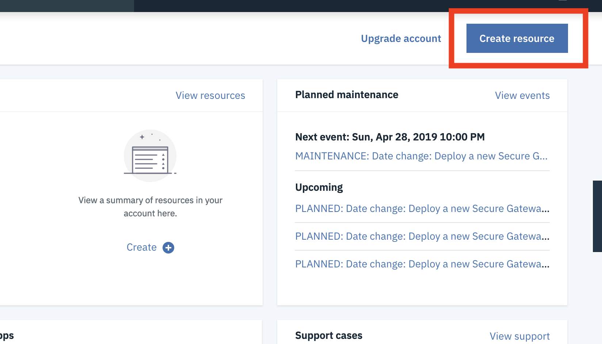
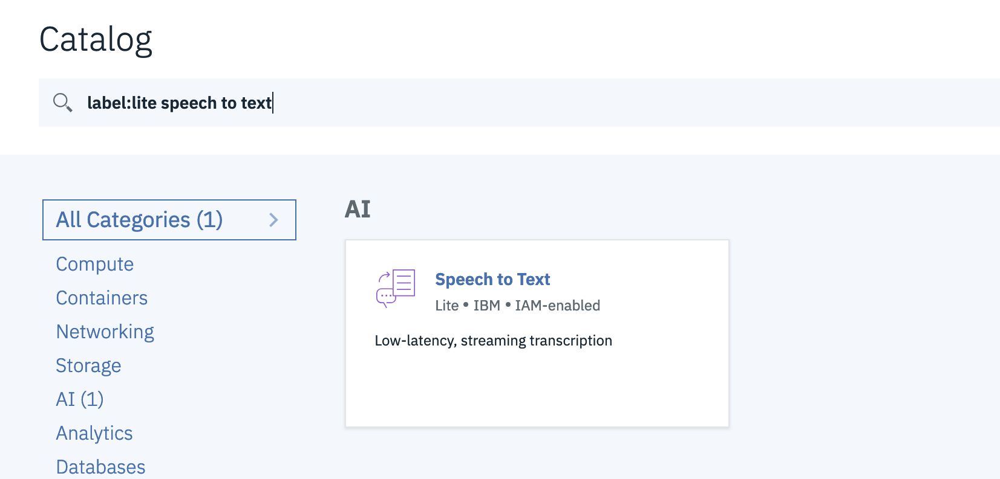
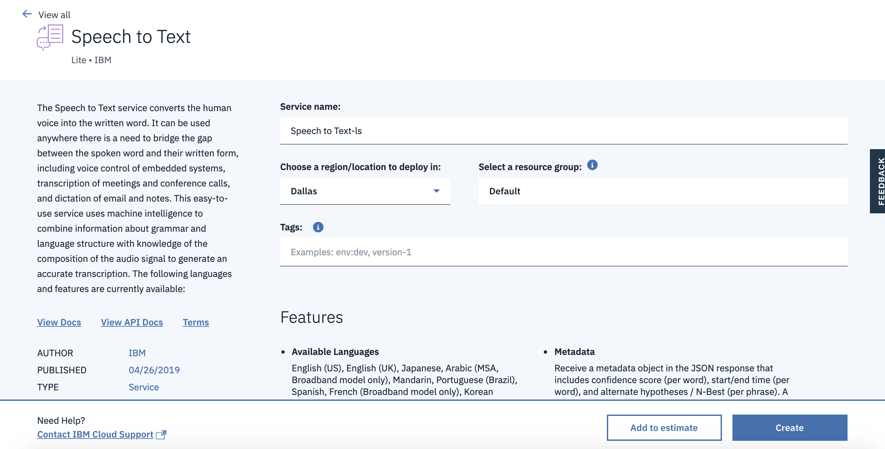
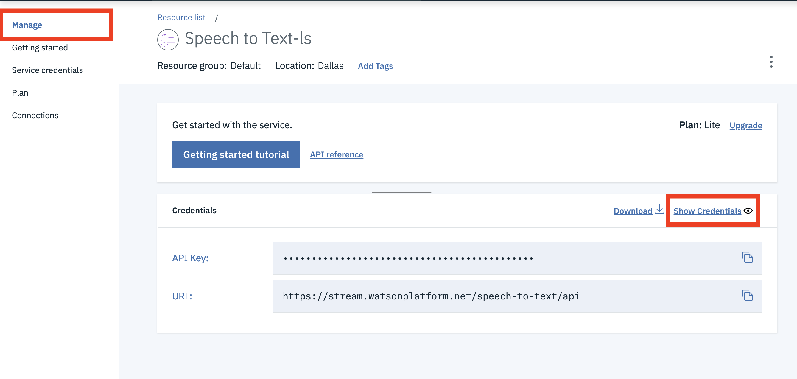
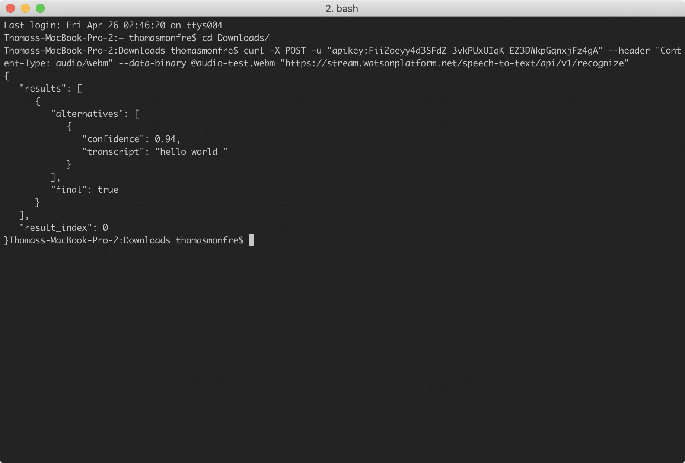

# CS52 Workshops: Cool APIs!


The Internet is an amazing place. In part because things like this exist:


But also because it has allowed for dedicated developers, whether at large corporations or part of the open source community, to build software that solves complex problems.

In the world of computer science, we care a lot about abstraction and layers. Cool APIs provide abstracted functionality to your web applications, making them robust and powerful. They can provide a lot of amazing functionality with relative ease. And, you can go around telling everyone your website incorporates ML, AI, etc!

## Overview

In this workshop, we're going to build a web app that allows a user to speak into their microphone, then sends that audio to the IBM Cloud to have the Watson Speech-To-Text engine return a string representing the words spoken, along with a confidence level for the accuracy of the prediction.

Here's a [live, deployed version](https://cs52-speech-to-text.surge.sh/) of what you're going to create.

You could use something like this in everything from an online chatbot/customer service client, to an ordering platform!

## Setup

First you'll need to setup an account with IBM Cloud. This will get you a unique API key that you can use when sending speech-to-text requests. Follow the steps below to complete the setup:

### Create An Account

1. Open this [link](https://cloud.ibm.com/registration).
2. Fill in the info needed and create an IBM account.
3. Go to your email to click on the confirmation link.
4. Click Log In.
5. **Proceed** with the acknowledgement (after reading the privacy statement of course -- like you always do :joy:).

### Create Speech-To-Text Resource

1. Click **Create Resource** in the upper right corner.



2. Search for **Speech for Text**, the service we'll be using today, and click on the result.



3. For "location to deploy in", keep it as "Dallas" and click Create.



### Copy Your Authentication Credentials

1. On the **Manage** page, click **Show Credentials** to view your auth credentials.



2. Copy the API Key, and just save it somewhere. We recommend opening a text file and pasting it there for the time being. You're going to need this for sending requests to Watson later!

## Test API Key

Just to confirm that your API key has been activated, download the audio file linked [here](https://drive.google.com/file/d/1CxHTUi0z0VlsbCE3_cCLLBLhXZXX-LEY/view?usp=sharing). 

Open up a new terminal window and `cd` into the directory you saved the file (probably your Downloads).

Run the following curl command:

```bash
curl -X POST -u "apikey:<YOUR API KEY>" --header "Content-Type: audio/webm" --data-binary @audio-test.webm "https://stream.watsonplatform.net/speech-to-text/api/v1/recognize"
```

You should see a returned output from IBM Cloud similar to the following:



Amazing! You just sent a request to IBM Cloud that processed an audio file and returned a transcript along with a confidence level. We can see here that Watson picked up "Hello World" and is 94% confident that those words are what was said.

If you got an error, especially something that says you only sent a certain number of bytes, please flag one of us so we can help you!

## Build Frontend

Okay neat. Now that we know we can at least communicate with Watson, let's build a front-end! We don't want users to have to download an audio file, open their terminal, and run a curl command. That would be ridiculous.

Instead, let's build a tool that allows them to speak into their mic, and we handle all the rest. To get started, let's get setup.

## Clone Repo

First clone (or fork) the repository:

```bash
git clone https://github.com/dartmouth-cs52-19S/workshop-ws-04-30-cool-apis
```

Change into the `app/` directory:

```bash
cd workshop-ws-04-30-cool-apis/app
```

Install the necessary packages:

```bash
yarn
```

:exclamation: If you're a Windows user, change the `scripts` object in your `package.json` in the `app/` directory to the following:

```javascript
"scripts": {
    "start": "SET NODE_ENV=development& webpack-dev-server",
    "test": "eslint src/**.js",
    "build": "yarn clean & SET WEBPACK_ENV=production& webpack --colors",
    "clean": "rimraf dist"
},
```

## Build Web App

Alright, let's think about what we are going to need for this web app. First, we definitely need to allow the user to speak into their microphone, and we need to hold onto that audio data. We're also going to want audio controls to start and stop the microphone. We also probably want an area for them to see the output from Watson.

Great, let's break these up into some components. Since our hierarchy is small, we don't need these to be connected components. Phew...


Okay, let's start with the microphone. On the surface, this seems kind of difficult. But, thanks to the open source community, someone has built a node package that provides a React component that acts as a microphone. It's called [react-mic](https://www.npmjs.com/package/react-mic), you should check it out!

Alright, let's add it to our project!

```bash
yarn add react-mic
```

Awesome. Now, let's render it! Here's some of our component structure. Where do you think it goes?

```
├──[app]/                        # root directory
|  └──[src]                      # source files
|     └──[components]/           # contains basic components
|        └──[Recorder.js]        # handles microphone
|        └──[Output.js]          # displays IBM output
|     └──[index.js]/             # has App component
```

If you thought `Recorder.js`, you're right!


### Audio Recorder

Great, open up `Recorder.js` (VSCode or Atom, your choice). You should see the basic architecture of a React component.

You're probably getting some linting errors right now because we've set it up as a smart component, even thought it doesn't hold any state yet. Hold on friend, it's coming.

First, let's import `react-mic` at the top of `Recorder.js`:

```javascript
import { ReactMic } from 'react-mic';
```

Then, in the render function, let's return a `ReactMic` component:

```javascript
<div>
    <ReactMic
        record={this.state.record}
        className="sound-wave"
        onStop={this.onStop}
        strokeColor="#000"
        backgroundColor="#fff"
    />
</div>
```

Wait... what does this do?

The `record` prop is a boolean indicating if the microphone should be recording or not. This is something that `react-mic` created and something they take care of. `className` should be familiar, that just allows us to target the component for styling. `onStop` is a function that is called when the microphone stops recording. `strokeColor` is the color of the sound wave, and `backgroundColor` is the color of the microphone area.

Once you paste that in, you'll probably be getting some linting errors, because our app has no state or methods. Let's fix that.  

In the constructor, add the following state:

```javascript
this.state = {
    record: false,
};
```

Then, add the `onStop` method to your `Recorder` class:

```javascript
onStop = (recordedBlob) => {
    this.props.sendAudioBlob(recordedBlob.blob);
}
```

Woah props?? We haven't constructed the `App` component yet. How are we supposed to know what values it will be sending to us? Good question, friend. Let's think about it.

:books: If `App` renders `Recorder` and `Output`, it should probably handle the request to Watson, right? So, `Recorder` gets the audio from the user and sends it to `App`. `App` sends that audio file to IBM Cloud who returns a transcript and confidence level back to `App`. `App` then passes that transcript to `Output` who displays it to the user. Simple, right? If that didn't make sense, read it again or flag one of us so we can explain it!

Okay, then `this.props.sendAudioBlob` is a function passed through props that will take the audio file from `Recorder` and pass it along to IBM. We haven't written that function yet, but we will later.

Okay, but what's a blob?? Blob objects are file-like objects that hold immutable, raw data. Files actually inherit from them. Dw if it doesn't make sense, we handled all the weird file stuff for you! Just be comfortable with us using the word Blob. At the very least, it's like a throwback to those cs10 dayz... :sunglasses:

Okay great! Now that we've explained that, we need a way to turn on the microphone. Since `this.state.record` is a boolean stating if the microphone should be on or off, let's just add a button that changes this value.

We're going to use [Material UI](https://material-ui.com/) for the button! That means we need to import it. While we're at it, let's import our styles too.

In `Recorder.js` paste the following at the top of the file.

```javascript
import Fab from '@material-ui/core/Fab';
import '../style.scss';
```

Make sure to install Material-UI:

```bash
yarn add @material-ui/core
```

Alright, back to `Recorder.js`. **Underneath** the `ReactMic` component, paste the following:

```html
<div className="fab">
    <Fab color="secondary" onClick={this.toggleRecording}>
        <i className="material-icons">{this.state.record ? 'stop' : 'mic'}</i>
    </Fab>
</div>
```

We can see that when the user clicks the button (`Fab`), we call the `this.toggleRecording` method. Inside the `Fab`, we render an icon from [font-awesome](https://fontawesome.com/icons).

Alright, let's make sure to add `this.toggleRecording` to our `Recorder` class:

```javascript
toggleRecording = () => {
    const { record } = this.state;

    this.setState({
      record: !record,
    });

    if (!record) {
      this.props.microphoneStarted();
    }
}
```

You can see that this basically just takes `this.state.record` and makes it false if it's true and true if it's false. Super clean syntax too!

Then, we call `this.props.microphoneStarted`. What is that? It's another function from `App` to tell `Output` that the microphone is recording. We haven't written it yet, but we know we need to later.

Okay, before you move on, make sure your `Recorder.js` file has the following specs:

* [ ] import `React`, `ReactMic`, `Fab`, and `styles.scss`
* [ ] hold a boolean `record` in state
* [ ] have `toggleRecording` and `onStop` functions
* [ ] render a `ReactMic` component and a `Fab` button.

### Render `Recorder`

Okay great, now let's render this component in `App`.

Open up `index.js`, and import `Recorder` at the top of the file. We're also going to need another Material UI component later, so let's just import it now:

```javascript
import Recorder from './components/Recorder';
import CircularProgress from '@material-ui/core/CircularProgress';
```

Alright here's the idea. First we render a `Recorder`. After the user speaks into the microphone, `Recorder` passes us some audio which we pass on to Watson. While we're waiting, let's have a loading icon so people know to wait.

To do that, let's add a boolean called `loading` into our state. In the constructor, add this:

```javascript
this.state = {
    loading: false,
}
```

Then, in the `App` component, let's add the following function:

```javascript
handleLoading = () => {
    if (this.state.loading) {
      return <CircularProgress color="secondary" />;
    }
    return <Recorder microphoneStarted={this.microphoneStarted} sendAudioBlob={this.getAudioBlob} />;
}
```

You can see that this function returns one of two possible React components. If `this.state.loading` is true, we return a loading bar from Material UI. If not, we return a `Recorder`.

Great! Let's call this function from our render method:

```javascript
return (
    <div className="container">
        {this.handleLoading()}
    </div>
);
```

Hey look, when we render `Recorder`, we're passing in those two functions (`microphoneStarted` and `sendAudioBlob`) we talked about before as props! Since we haven't written them yet, we should do that now. :rocket:

Let's create `microphoneStarted` first. In `App`, create this function:

```javascript
microphoneStarted = () => {
    this.setState({
        audioText: 'listening...',
    });
}
```

You can see that this function basically just sets `this.state.audioText`, which is just a string. This will be displayed to the user, giving them instructions or telling them what is going on (i.e. we're waiting for IBM, etc.)

Before we forget, let's add that to our state. In the constructor, set your declaration of `this.state` to the following:

```javascript
this.state = {
    loading: false,
    audioText: 'click the microphone to record some audio!',
}
```

Great! Now, if you remember from before, the `Recorder` component expects a second function passed in through props. This function gets the audio blob from `ReactMic` and passes it along to `App`. Let's add that now:

```javascript
getAudioBlob = (blob) => {
    this.setState({
      audioBlob: blob,
    });

    this.sendRequest();
}
```

Looks like we have another thing to add to our state! In the constructor, make sure `this.state` is set to:

```javascript
this.state = {
    loading: false,
    audioText: 'click the microphone to record some audio!',
    audioBlob: null,
}
```

What's an `audioBlob`? It's basically just the audio of what the user said in the form of binary data.

What's `this.sendRequest` you ask? That's a function that we have to write that will take `this.state.audioBlob` and give it to IBM to transcribe. Let's create it now! :rocket:

In your `App` class, add the following function:

```javascript
sendRequest = () => {
    console.log('sending a request to IBM...');
}
```

We're definitely going to want to add stuff to this later, but for now let's just console log so we know our frontend is working.

### Test It Out

Let's test this out.

Make sure you're in the `app` directory, then run `yarn start`. Open up [localhost:8080](http://localhost:8080) in Chrome. You should see the `Recorder` component rendering.

Try to record some audio, it should record you, then when you click the stop button it will show you the loading icon. If you open up Chrome DevTools, you should have console logged `sending a request to IBM...`. Flag one of us if this isn't working for you!

You'll probably have some lint error. That's okay! We'll fix them all later.

Alright, so let's take stock. Your `App` component should:

* [ ] import `React`, `ReactDOM`, `Recorder`, and `CircularProgress`
* [ ] hold `loading`, `audioText`, and `audioBlob` in state
* [ ] have `getAudioBlob`, `microphoneStarted`, `handleLoading`, and `sendRequest` functions
* [ ] have a `render` function that calls `handleLoading`

Awesome! Now we have a way for the user to record themselves and we have a way to hold onto what they said. Now let's pass it along to IBM

### Send Request to Watson

In order to send the file to Watson, we're going to need a Node/Express server. Whaaaaaat? We haven't learned that yet!

You're right. We're sorry. But don't fret for long, because we made pretty much the entire thing for you.

Go back to the root, then `cd` into the `server` directory.

```bash
cd ../server  ## your number of ../ might vary
```

Now, install all the project dependencies:

```javascript
yarn
```

Great. Open up `src/server.js` in VSCode or Atom (your choice). 

We'll leave it to Tim to explain how all of this works in depth, but all you really need to know is that `src/server.js` is where our server lives. When we run this server from the command line (using `yarn start`) our app "listens" on port 9090 for incoming requests.

If you open up `src/server.js`, you'll see this on line 26:

```javascript
app.post('/', upload.single('file'), (req, res, next) => { ...
```

This sets up the base route of our server (i.e. `localhost:9090/`) to be a POST request that takes in a file called `file`. In the actual function, you'll see a request being made to IBM Cloud. This basically takes the audio Blob from `ReactMic`, saves it locally as a file, passes that file onto Watson, and waits for a response. Once it gets a response from Watson, it deletes the audio file on the server and sends the response to our front-end. How cool!

:rocket: On line 36 where it says `<YOUR API KEY>`, you guessed it, paste in your API key from IBM.

Aaaaaaand that was it. Not so bad, right? Back to the frontend!

### Send Audio to Server

Great so now that `App` has the audio blob and we've built a server that handles all communication with Watson, all we have to do is pass that blob to the server.

In the `app` directory, open up `index.js`.

Can you think of where we should send our blob to the server? If you thought the `sendRequest` function, you're right!

Instead of console logging, paste this into the `sendRequest` function:

```javascript
sendRequest = () => {
    this.setState({
        audioText: 'sending a request to IBM Watson...',
    }, () => {
        const URL = 'http://localhost:9090/';

        const formData = new FormData();
        formData.append('file', this.state.audioBlob, 'recording.webm');

        const request = new XMLHttpRequest();

        request.onload = () => {

            if (request.response !== undefined) {
                const outputFromIBM = request.response.results[0].alternatives[0];

                this.setState({
                    text: outputFromIBM.transcript,
                    confidenceLevel: outputFromIBM.confidence,
                    audioText: null,
                });
            }
        };

        request.open('POST', URL, true);
        request.responseType = 'json';
        request.send(formData);
    });
}
```

What does this do? Well first it changes `this.state.audioText` so we can tell the user that we're sending a request.

Then, after that occurs, it makes a POST request to our server and passes along the audio blob. When the server responds, we save the output in our state.

If you look where we call `this.setState`, we've added some new things to our `state`! `this.state.text` is the transcript from IBM and `this.state.confidenceLevel` is the reported confidence score from IBM.

In order to make sure we always have access to this, let's initialize them.

In the constructor function, you should now have:

```javascript
this.state = {
    loading: false,
    audioText: 'click the microphone to record some audio!',
    audioBlob: null,
    text: '',
    confidenceLevel: null,
}
```

Great. Let's go back to the `sendRequest` function for a minute. 

What do you think that `FormData` business is? Well, it's basically just a module that we're using to send the blob (remember it's just a binary data file) to the server.

You're probably getting a linting warning about it because you haven't imported it.

Add this to the top of `index.js`:

```javascript
import FormData from 'form-data';
```

Awesome! Let's take stock of where we're at. Your `App` component should now:

* [ ] import `React`, `ReactDOM`, `Recorder`, `CircularProgress`, and `FormData`
* [ ] have `loading`, `audioText`, `audioBlob`, `text`, and `confidenceLevel` in state
* [ ] have the same functions as before
* [ ] have a filled in `sendRequest` function
* [ ] allow users to record audio, then send that audio to the server
* [ ] when it gets results, it should save them in `this.state`

### Test It Out

Before we display those results, let's just test this out. One way to do that is to just add some console logs to your `render` function.

Before you return anything in the render function (aka first line of the function), just add `console.log(this.state.text)`.

Then, open up not one but **two** terminal windows/tabs. Make sure one of them is in the `app` directory and the other is in the `server` directory.

Run `yarn start` from both.

Open up Chrome and Chrome DevTools. Go to [localhost:8080](http://localhost:8080/).

Record some audio, and watch your console for logs. You should eventually get a text of what you said logging in the console. Flag us if that doesn't work!

### Display Results

Alright, so now that we have the transcribed text coming from Watson, let's display it to our user in a nice way.

Create the file `Output.js` in `app/src/components/`. Open it up.

First, let's import `react` + our styles:

```javascript
import React from 'react';
import '../style.scss';
```

Then, let's create the `Output` component. This component only really needs to display things. It probably won't need a state for itself. Because of this, let's just make it a dumb component:

```javascript
const Output = (props) => {
  
};

export default Output;
```

Then, let's add in what we want to display:

```javascript
if (props.audioText) {
    return <h1>{props.audioText}</h1>;
} else {
    return (
      <div>
        <h1>{props.text}</h1>
        <b>{`Confidence level: ${props.confidenceLevel}`}</b>
      </div>
    );
}
```

Can you see what this is doing? If there's some intermediary information to show the user, display it to them. Otherwise, show the transcript and confidence level from IBM.

Wow, that was easy!

### Connect it Together

Go back to `index.js`. Let's import `Output`.

```javascript
import Output from './components/Output';
```

Then, let's add it to our render function. Remember what it needs as props? `audioText`, `text`, and `confidenceLevel`...

Paste this into the render function **above** the call to `this.handleLoading`.

```html
<Output audioText={this.state.audioText} text={this.state.text} confidenceLevel={this.state.confidenceLevel} />
```

### Test It Out

Sweet! Let's try to bring it all together now. Open up those **two** terminal windows/tabs again.

Make sure one is in the `app` directory and the other is in the `server` directory.

Run `yarn start` from both.

You should see that the server is listening on port `9090` and our frontend is being served on port `8080`.

Great, then open up Chrome again and go to `localhost:8080`. Record some audio then see that your app sends the audio to IBM, waits for a response, then displays the output.

If you have problems, let us know!

## Recap

Wow look at that! You can record whatever you want and then get the transcript version of it! All for free + a little work. How neat! Hopefully, it made you more confident about incorporating these amazing and powerful API's into your own work!

## Summary

Soooo, what was the point of all of this?

Well, this workshop (hopefully) demonstrates how to leverage the power of pre-existing APIs that do some pretty complex and impressive things into *your* React app! It also hopefully allowed you to dip your toes into some server-side programming in Node.

Just as a little note, for stuff like this where you're passing around files or making a lot of API calls, it is relatively common to set up a server to handle those requests. That's why we needed the Node/Express server for this workshop.

This structure of programming also abstracts out communication that the frontend doesn't necessarily have to be privy to. Consider how we use it here: Watson API requires a .webm file, but to convert a blob into a file isn't the most straightforward thing. Our server does all the middle work of converting the file, sending it to Watson and receiving the response. Then it just passes what we want from Watson onto the frontend.

## What You Learned

* [ ] Different APIs/cloud computing platforms and what they offer: Microsoft Azure, Google Vision, IBM Watson, AWS, and Twilio!
* [ ] How to setup an account with IBM Cloud and use the Speech-To-Text API.
* [ ] How to allow the user to record audio.
* [ ] How to send requests to the API, parse the response, and display it
* [ ] A fairly common setup for a full-stack web app!

## Reflection

Make sure to answer these questions on Canvas:

1. How might AWS be used by developers and how is it different than Microsoft Azure, Google Cloud Vision, and IBM Watson?
2. What's one example of a cool API that we talked about that you could use in a React app? What are the pros/cons of that specific API?

Also, please leave us feedback on Canvas!

## Resources

* [IBM Watson Speech-To-Text Example](https://github.com/AaronWard/IBM-Watson-Speech-To-Text)
* [react-mic example](https://www.npmjs.com/package/react-mic)
* [another react-mic example](https://hackingbeauty.github.io/react-mic/)
* [multer middleware](https://github.com/expressjs/multer)
* [express-form-data docs](https://www.npmjs.com/package/express-form-data)
* [sending binary data with node](https://stackoverflow.com/questions/48994269/nodejs-send-binary-data-with-request)
* [React/Node DALI Workshop](https://github.com/dali-lab/react-node-workshop-backend)
* [Material UI](https://material-ui.com/)