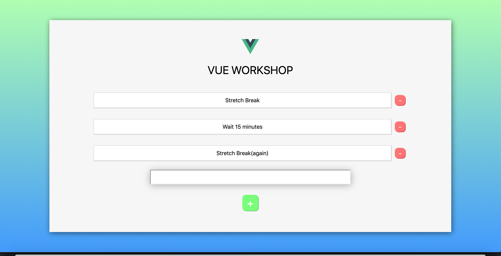
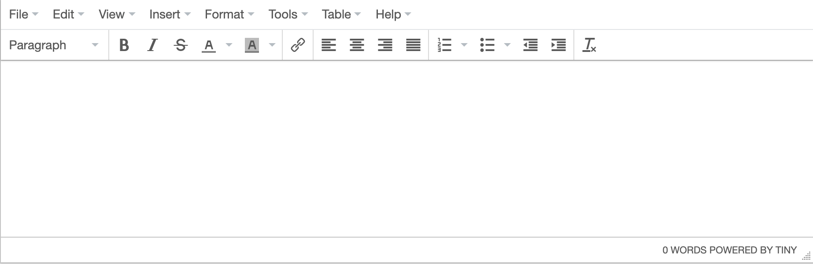

# CS52 Workshops: Alternative Front-End


  
Using frontend libraries and/or frameworks  allows developers to have pre-made components so as to not have to write code from scratch. This also allows for more efficiency, with fewer lines of code. Coders of all levels benefit from frameworks, either by using popular ones such as React, Angular, and Vue, or for more advanced coders to create their own that works best for them.

## Overview

To start, we'll be making a simple to do list app in Vue.js. Then, we'll add an in-page editor to the application.

## Setup

Go ahead and set up a directory you can work in. Then fork this repository so you can have the skeleton of what we're building today.

Install Vue.js and the Vue CLI.

    yarn add vue
    yarn global add @vue/cli

Go ahead and rip a `yarn` while you're at it too to make sure you've got all the dependencies taken care of.

To run locally at any point, simply do:

    yarn start

After calling yarn start, you shouldn't see anything just yet!

Tip! Use the Vue extension for VS Code: [Vetur](https://marketplace.visualstudio.com/items?itemName=octref.vetur). It may pop up as an optional extension


## Step by Step

### PART 1: The To Do List

You may be looking for all the .html, .css, .js files...

Well what if you could have all of that in one file?


  

In this workshop we'll primarily be working in 2 files:

* `src/ToDo.vue`
* `src/components/ToDoItem.vue`

These .vue files will contain all of the HTML, CSS, and JavaScript code in a Single File Component. Wow!

They're both empty right now besides the styling right now. Let's populate them!

Open `src/ToDo.vue`

Start with a template and script tags above the style tags.

```
<template>

</template>


<script>

</script>
```

  

Tip! If you're making comments inside the `<template>` tags, the comment is HTML-style and inside the `<script>` tags is JavaScript-style.

` <!--This is an HTML comment!--> `

` /* This is a JavaScript comment! */ `


We'll start off with a basic HTML structure.


Create a div with the id `"app"`.

Nested inside of `#app` create a div with the class `"ToDo"`.

Nested inside `.ToDo` put a header tag with a title for your To Do List and the Vue logo. Make sure to import it as well.

Beneath the header put a div with the class `"ToDo-Container"`.

Nested inside of `.ToDo-Container` put a div with the class with the title `"ToDo-Content"`.


Here's what you should have so far:

```
<template>
  <div id="app">
    <div class="ToDo">
    
    <h1 class="ToDo-Header"> Vue Workshop</h1>
      <div class="ToDo-Container">
        <div class="ToDo-Content">  

        </div>
      </div>
    </div>
  </div>
</template>

<script>
import Logo from './assets/logo.png'
</script>
```

  
  
This part should look familiar! The `template` tag here essentially acts as our `render()` function in react. This is the html that gets passed along to the webpage.

Now onto the interesting stuff!

  

Open `ToDoItem.vue` in your `src/components` folder, and add the following to it.

```html
<template>
  <div  class="ToDoItem">
    <p class="ToDoItem-Text">{{todo.text}}</p>
    <div class="ToDoItem-Delete" @click="deleteItem(todo)">-
	</div>
  </div>
</template>
```
This once again should look familiar as it is just simple `html`. `@click` is just our onClickListener. Neat!

```javascript
<script>
  export  default  {
  name: "to-do-item",
    props: ['todo'],
  }
</script>
```

Here `name` is the name of the component and `props` is the input to the component.

Inside the export default tag beneath props, let's add some methods:
```javascript
methods: {
  deleteItem(todo) {
    this.$emit('delete', todo)
  }
}
```
Here `delete` is the name of the function that will get passed back up to ToDo. `$emit` triggers an event that also links with ToDo.

Let's go back to `ToDo`. We'll start by importing `ToDoItem` in the script tags.

```javascript
import ToDoItem from './components/ToDoItem.vue'

export default {
  name:  'to-do',
  components: {
    ToDoItem
  },
}
```

Beneath components add:
```javascript
data() {
  return {
  
  }
},

methods: {

}
```


Inside of the return tag we are creating an array with some generic to do items. Feel free to change the content if you'd like. This is simply the baseline list of items that appears whenever we reload the page.
```javascript
list: [
  {
    id: 1,
    text: 'Stretch Break'
  },
  {
    id: 2,
    text: 'Wait 15 minutes'
  },
  {
    id: 3,
    text: 'Stretch Break(again)'
  }
],
todo: '',
```

  
  
  

Inside of your `.ToDo-Content` div, we are going to add our `ToDoItem`:

  

```html
<ToDoItem  
  v-for="todo in list"
  :todo="todo"
  @delete="onDeleteItem"
  :key="todo.id"  />

```

  

There is a lot of Vue shorthand going on here! To explain:

`todo` is our prop we defined in ToDoItem

`v-for` renders a list of items (so we just rendered our list of ToDoItems). This can almost be thought of as a for loop.

`@delete` refers to the name of the function that we just passed up from `ToDoItem`. See how it's coming together?
  

Next we need to be able to create new items. Within methods of the ToDo file add:

  

```javascript
createNewToDoItem() {
//Make sure something is in todo
  if (!this.todo){
    alert("You need to enter some text!");
    return
  }

  const newId = Math.max.apply(null, this.list.map(t  =>  t.id)) + 1;

  this.list.push({ id:  newId, text:  this.todo });

  this.todo = '';

},
```

The first `if` statement displays an alert if there is nothing inputted.
Otherwise, it creates a new id (the next number in the list) and adds it to the list, using `push`.
  

We also need to be able to delete items after we've added them. Add this to `ToDo`'s methods as well:

```javascript
onDeleteItem(todo){

  this.list = this.list.filter(item  =>  item !== todo);

}
```
The `filter` tag simply resets the list to be everything in it that isn't the `todo` that's passed in. Looking back up, the `todo` that gets passed in comes from our `ToDoItem`.
  
  
  

Finally add an input text bar under your `ToDoItem` in HTML to type your to do items and a button to submit them:

```html
<input type="text" v-model="todo"  v-on:keyup.enter="createNewToDoItem"/>

<div  class="ToDo-Add"  @click="createNewToDoItem()">+</div>

```
  
These allow you to add a new item by either hitting enter or by hitting the button!

The styling comes from the css inside the `style` tag at the bottom of the file. Feel free to style the page in whichever way you'd like.

Run `yarn start` and see what happens. Why isn't the list popping up?????

It's because we haven't attached our components to the `index.html`. 

Navigate to `src/main.js`

Add the following to the file
```javascript
new Vue({
  render: h => h(ToDo)
}).$mount('#app')
```

And import the ToDo component at the top
```javascript
import ToDo from './ToDo.vue'
```

This mounts the ToDo component onto the `app div` in `index.html`

Now if you look at each `vue` file, you'll see that each contains the HTML, CSS and Javascript associated with it, giving you the Single File Component.

And there you have it!


### Part 2: Add an Editor

At this point you should have a basic application which can add and delete todo items. 


But, what if we had an editor to make our notes pretty?



First, install the *tinymce* editor.

    yarn add vue-tinymce-editor

Great! Now import it in `ToDo.vue`.

```javascript
import tinymce from 'vue-tinymce-editor';
```

You’ll also need to list it as a component being used.

```javascript
components: {
  ToDoItem,
  tinymce,
},
```

Go ahead and delete your `input` tag and replace it with the fancy new `tinymce` tag.

```html
<tinymce id="d1"
           :other_options="tinyOptions"
           v-model="todo"
           v-on:keyup.enter="createNewToDoItem"
></tinymce>
```
The tags here are fairly self-explanatory. The `id` is simply how we reference it. `:other_options` allows for flexibility with the options of the editor, something we will add in soon. 

Finally, specify some options for styling the component in the `data` function. Your data function should look like this now.

```javascript
data() {
     return {
         list: [
             {
               id: 1,
               text: 'Stretch Break'
             },
             {
               id: 2,
               text: 'Wait 15 minutes'
             },
             {
               id: 3,
               text: 'Stretch Break(again)'
             }
         ],
         todo: '',
         logo: Logo,
         tinyOptions: {
                   'height': 200
           },
     }
},
```

Whoa! We have a fancy new editor now instead of the plain ol’ input tag. You should be able to add and delete different ToDo items with the new editor. 

Run `yarn start` to see what it looks like. 

Now try and add a new note.

Hold the phone… the ToDo items don’t keep the styling that the *tinymce* has and adds HTML tags on the end instead. Well, don’t fret, Vue has a special attribute for this: `v-html`. Remove the inner html and add this property to the `<p>` tag in `ToDoItem.vue`.

```html
<p class="ToDoItem-Text" v-html="todo.text"></p>
```

Now your notes can be edited in the editor AND look electric when added. That’s it! How simple! Thanks, Vue!


## Summary / What you Learned

* [ ] A new front-end framework!
* [ ] Why frontend frameworks and libraries are awesome, and which are the most popular: angular, react, vue, backbone, ember
* [ ] How to set up a project using Vue
* [ ] How to add an editor to your project
* [ ] Better understanding of what exactly React does


## Reflection

Make sure to answer these questions on Canvas!

* [ ] Why are frontend frameworks and libraries useful?
* [ ] How is Vue.js different from React, and what are the pros and cons of using either??


## Extra Credit

* [ ] Turn in something other than a to-do list -- get creative!
* [ ] Style your website so it looks a lot better!
* [ ] Add a new Vue component

## Resources

* Vue.js docs: https://vuejs.org/v2/guide/
* https://github.com/sunil-sandhu/vue-todo 
* https://vuejsfeed.com/blog/tinymce-editor-component-for-vue-js
* https://towardsdatascience.com/what-are-the-pros-and-cons-of-using-vue-js-3689d00d87b0
